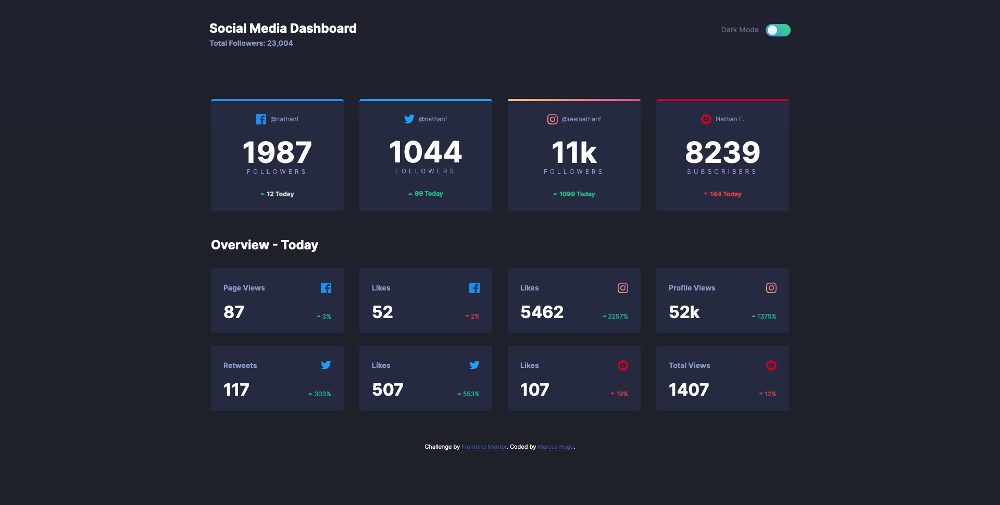

# Frontend Mentor - Social media dashboard with theme switcher solution

This is a solution to the [Social media dashboard with theme switcher challenge on Frontend Mentor](https://www.frontendmentor.io/challenges/social-media-dashboard-with-theme-switcher-6oY8ozp_H). Frontend Mentor challenges help you improve your coding skills by building realistic projects. 

## Table of contents

- [Overview](#overview)
  - [The challenge](#the-challenge)
  - [Screenshot](#screenshot)
  - [Links](#links)
- [My process](#my-process)
  - [Built with](#built-with)
  - [What I learned](#what-i-learned)
  - [Continued development](#continued-development)
  - [Useful resources](#useful-resources)
- [Author](#author)
- [Acknowledgments](#acknowledgments)


## Overview

### The challenge

Users should be able to:

- View the optimal layout for the site depending on their device's screen size
- See hover states for all interactive elements on the page
- Toggle color theme to their preference

### Screenshot



### Links

- Solution URL: [https://github.com/marcus-hugo/social-media-dashboard-with-theme-switcher-master](https://github.com/marcus-hugo/social-media-dashboard-with-theme-switcher-master)
- Live Site URL: [https://marcus-hugo.github.io/social-media-dashboard-with-theme-switcher-master/](https://marcus-hugo.github.io/social-media-dashboard-with-theme-switcher-master/)

## My process

### Built with

- Semantic HTML5 markup
- CSS custom properties
- Flexbox
- CSS Grid
- Mobile-first workflow
- Sass
- Vanilla JS

### What I learned
Setting up a Sass folder structure.  Set up Sass to output to CSS and watch for file changes with Sass CLI.  Also, used VS Code extension Live Server.  Importing partials with `@use`.  Created a simple mixin.  Using namespaces to reference mixins with `@include namespace.mixin`.  

Creating a dark theme that can be switched on and off with a toggle button made with an input checkbox.  Having a `prefers-color-scheme` based on user's OS settings.  Each of these on their own are prettty simple, but, when both are implimented I needed to add a dark-theme class as well as a light-theme class.  I wanted the toggle position to stay the same for either mode wether `prefers-color-scheme` was overiding or the manual switching.  That's where `window.matchMedia.matches` came in handy to identify the OS preference.  Then I had a problem on reload, where the toggle position would stay in the same position and the toggling would be backwards.  So I researched `window.onload` and made a function: 

```js 
function togglePosition() {
  if(mediaQueryList.matches === true || body.className === 'light-theme') {
    checkbox.checked = true;
  } else {
    checkbox.checked = false;
  }
} 
```
Also, found that using the checkbox method gave acces to `checkbox.checked` to set the checkbox position on reload.


### Continued development
Refactoring JS.  Learning more about Sass.


### Useful resources
- Sass folder structures
https://itnext.io/structuring-your-sass-projects-c8d41fa55ed4

- Toggle Switch
https://www.w3schools.com/howto/howto_css_switch.asp

 - For `window.matchMedia`
    - https://developer.mozilla.org/en-US/docs/Web/API/MediaQueryList/addListener
 
    - https://stackoverflow.com/questions/56466261/matchmedia-addlistener-marked-as-deprecated-addeventlistener-equivalent

- On load event
// https://developer.mozilla.org/en-US/docs/Web/API/Window/load_event

 - higlight title on hover of switch
 https://jsfiddle.net/ThinkingStiff/dWHzF/

## Author

- Website - [Marcus Hugo](https://marcus-hugo.github.io/My-Personal-Website/)
- Frontend Mentor - [@marcus-hugo](https://www.frontendmentor.io/profile/marcus-hugo)

## Acknowledgments

